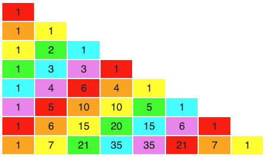
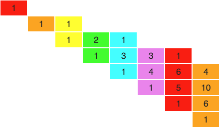

## Change ringing: counting the number of method constructions

If we want to try to count how many possible methods there are of various types (plain, treble bob, etc) on different stages, we start with a fundamental question: 

*How many distinct place notations are there for a row on stage* n?

Let's start with an example, a list of all possible place notation[^1] for stage 4:

[^1]: We only deal with well-formed place notation in this article. By this we mean that all places made are explicit. For example, on stage 6, these are badly formed: `1` (should be `16`), `134` (should be `1234`).

Schematic  Place notation
---------  -------------------
`1234`       
`><><`       `x`
`><||`       `34`
`|><|`       `14`
`||><`       `12`
`||||`       `1234`
---------  -------------------

Table: All possible place notations for stage 4

Note that we use `><` to represent two bells crossing: we use two characters because of course two bells are involved. The `|` character represents a bell remaining in place.

This is looking like a combinatorial problem - given $a$ items, choose $b$ of them - but there's a catch here: the `><` occupies two characters, but it represents a single thing conceptually: two bells crossing. To add some clarity, let's rewrite our table, but using `x` instead of `><`:

Schematic  Place notation
---------  -------------------
`xx`       `x`
`x||`      `34`
`|x|`      `14`
`||x`      `12`
`||||`     `1234`
---------  -------------------

Table: Altered schematic for all possible PN for stage 4x

Since the string for each code above contains a single character - `x` or `|` - for each possibility, it's more like an *a choose b* combinatorial problem. But note that we have code strings of varying lengths. 

With a little thought and you can see that the length of each string is $n$ minus the count of $x$ in the string. And from there we can break this down into $_n\mathrm{C}_r$ expressions for combinations of `x` in the code:

Code       string length $x$ count Combinations for $x$ occuring
---------  ------------- --------- -----------------------------
`xx`        2            2         $_2\mathrm{C}_2 = 1$ 
`x||`       3            1         ]
`|x|`       3            1         ] $_3\mathrm{C}_1 = 3$
`||x`       3            1         ]
`||||`      4            0         $_4\mathrm{C}_0 = 1$
---------  ------------- -------   -----------------------------

 
Let's use $\mathbb{P}(n)$ to denote 'number of possible place notations on stage $n$'. In this case we have:

$$\mathbb{P}(4) = {_2\mathrm{C}_2} + {_3\mathrm{C}_1} + {_4\mathrm{C}_0} = 5$$

If you analyse stage 5, you get:

$$\mathbb{P}(5) = {_3\mathrm{C}_2} + {_4\mathrm{C}_1} + {_5\mathrm{C}_0} = 5$$

And for stage 6:

$$\mathbb{P}(6) = {_3\mathrm{C}_3} + {_4\mathrm{C}_2} + {_5\mathrm{C}_1} + {_6\mathrm{C}_0} = 8$$

There's a pretty obvious pattern emerging. The equation for any stage is:

\begin{equation}
\mathbb{P}(n) = \sum_{i=0}^{\lfloor n/2 \rfloor} {_{n-i}\mathrm{C}_i}
\end{equation}

If you look at the first few values for the $\mathbb{P}$ function, you'll see a familiar sequence emerging:

n                0  1  2  3  4  5  6  7  8  9
---              -- -- -- -- -- -- -- -- -- --
$\mathbb{P}(n)$  1  1  2  3  5  8  13 21 34 55

It's the Fibonacci sequence[^2]. So we now have a tidy definition for $\mathbb{P}$:
 
\begin{equation}
\begin{split}
\mathbb{P}(n) = fib(n+1)
\end{split}
\end{equation}

See Appendix A for an aside on Fibonacci in Pascal's Triangle.

 [^2]: Proofs are available, e.g. by induction, that the given combinatorial sum in (1) gives the terms in the Fibonacci sequence

## No-constraint method with plain lead length

This is a method of lead length $2n$ and no other restrictions on content.

## Plain hunt methods

Schematic               Combos
-----------------       -------------------
`12345678`   
`><......`                $\mathbb{P}(6)$ or $\mathbb{S}(0,6)$ 
`|><.....`                $\mathbb{P}(5)$ or $\mathbb{S}(1,5)$
`..><....`                $\mathbb{S}(2,4)$
`...><...`                $\mathbb{S}(3,3)$
`....><..`                $\mathbb{S}(4,2)$ 
`.....><|`                $\mathbb{P}(5)$ or $\mathbb{S}(5,1)$
`......><`                $\mathbb{P}(6)$ or $\mathbb{S}(6,0)$
`.......|`                $\mathbb{P}(7) - 1$
\hphantom{xxxxx}`><|`
\hphantom{xxxx}`><`
\hphantom{xxx}`><`
\hphantom{xx}`><`
`|><`
`><`
`|.......`                $\mathbb{P}(7) - 1$
-----------------       --------------------

Table: Plain Hunt Major combinations schematic

Schematic               Combos
-----------------       -------------------
`123456789`   
`><.......`                $\mathbb{P}(7)$ or $\mathbb{S}(0,7)$ 
`|><......`                $\mathbb{P}(6)$ or $\mathbb{S}(1,6)$ 
`..><.....`                $\mathbb{S}(2,5)$
`...><....`                $\mathbb{S}(3,4)$
`....><...`                $\mathbb{S}(4,3)$ or $\mathbb{S}(3,4)$
`.....><..`                $\mathbb{S}(5,2)$ or $\mathbb{S}(2,5)$
`......><|`                $\mathbb{P}(6)$ or $\mathbb{S}(6,1)$ 
`.......><`                $\mathbb{P}(7)$ or $\mathbb{S}(7,0)$
`........|`                $\mathbb{P}(8) - 1$
\hphantom{xxxxx}\vdots
`|........`                $\mathbb{P}(8) - 1$
-----------------       --------------------

Table: Plain Hunt Caters combinations schematic

Schematic               Combos
-----------------       -------------------
`123456789E`   
`><........`                $\mathbb{P}(8)$
`|><.......`                $\mathbb{P}(7)$
`..><......`                $\mathbb{S}(2,6)$
`...><.....`                $\mathbb{S}(3,5)$
`....><....`                $\mathbb{S}(4,4)$
`.....><...`                $\mathbb{S}(5,3)$ or $\mathbb{S}(3,5)$
`......><..`                $\mathbb{S}(6,2)$ or $\mathbb{S}(2,6)$
`.......><|`                $\mathbb{P}(7)$
`........><`                $\mathbb{P}(8)$
`.........|`                $\mathbb{P}(9) - 1$
\hphantom{xxxxx}\vdots
`|.........`                $\mathbb{P}(9) - 1$
-----------------       --------------------

Table: Plain Hunt Royal combinations schematic

$$\mathbb{C}_p(n) = \prod_{i=2}^{n-4} fib(i)$$

# scratch 

## Fibonacci factorial ('fibofac') definition

Method type             Denoted           Definition
------------         --------------       ----------------
Plain Double         $\mathbb{C}_{pd}(n)$ $f\!\!f(n)$
Plain                $\mathbb{C}_p(n)$    $f\!\!f(n)^2$
Treble Bob Double    $\mathbb{C}_{td}(n)$ $f\!\!f(n)^4$
Treble Bob           $\mathbb{C}_t(n)$    $f\!\!f(n)^8$
---------            --------------       ----------------

$$ f\!\!f(n) = \prod_{i=0}^{n} fib(i)$$

$$ \dot a = fib(a)$$

${n \choose x}$

## Split parity paradox

$_n\mathrm{C}_{r-1} \cdot b$

$_n\mathrm{C}_r-1$

$\ddot 8 \cdot \dot 7 !$

$f\!\!f(7)$

$ff(7)$

\newpage

# Appendix A: Fibonacci and Pascal's Triangle

We know that $\mathbb{P}(n)$ is the sum of $_n\mathrm{C}_r$ combinatorial terms, and that these terms can be read off Pascal's Triangle.

This means that if you view Pascal's triangle left-aligned, the Fibonacci numbers (and hence $\mathbb{P}(n)$) appear as the sum of diagonals running SW-NE:

{height=300px}

If you skew the triangle rows more to the right, the pattern is even more obvious:

{height=300px}

[comment]: <> (\includegraphics{images/pascalsDiagonalsFibonacci.png})

